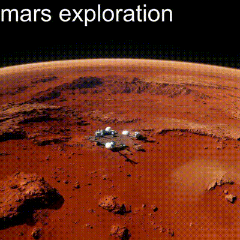

# Image and Video Generation with Text Overlay

This project enables the generation of images using text prompts, overlaying text on the generated images, and creating videos from these images with background music. The project utilizes Hugging Face APIs for text and image generation, and leverages OpenCV and MoviePy for video processing.

## Prerequisites

Before starting, ensure that you have the following installed:

- Python 3.x
- `requests`
- `Pillow`
- `numpy`
- `opencv-python`
- `moviepy`

Install the required packages using:

```bash
pip install -r requirements.txt
```

## API Calls
**https://api-inference.huggingface.co/models/stabilityai/stable-diffusion-3-medium-diffusers**

**https://api-inference.huggingface.co/models/mistralai/Mistral-7B-Instruct-v0.3**

## Files

- **`image_gen.py`**: Generates images using text prompts and overlays text on the images.
- **`app.py`**: Orchestrates the entire process from generating images to creating a video.
- **`video.py`**: Creates a video from generated images and adds background music.

## Usage

### 1. Generate Images and Create Video

To generate images and create a video, run the `app.py` or 'streamapp.py' script:

```bash
python app.py
streamlit run streamapp.py
```

You will be prompted to enter the following details:

- **Base prompt** for image generation
- **Number of unique images** to generate
- **Path to the music file**
- **Text to overlay** on the video
- **Folder to save generated images** (default is `images`)
- **Name of the output video file**
- **Frame rate** for the video (default is 4)

### 2. Individual Scripts

#### `image_gen.py`

This script generates images based on text prompts and overlays specified text on the images. You can run it separately if you wish to generate images without creating a video.

```bash
python image_gen.py <base_prompt> <n> <text> <output_dir> <text_color>
```

- **base_prompt**: The base text prompt for generating images.
- **n**: Number of unique images to generate.
- **text**: Text to overlay on the images.
- **output_dir**: Directory to save the generated images (default is `images`).
- **text_color**: Color of the overlay text (default is auto).

#### `video.py`

This script creates a video from images in a specified folder and adds a background music track.

```bash
python video.py <image_folder> <output_video> <music_file> <frame_rate>
```

- **image_folder**: Folder containing the generated images.
- **output_video**: Name of the output video file.
- **music_file**: Path to the music file.
- **frame_rate**: Frame rate for the video (default is 4).

## Example

To generate 5 images based on a prompt, overlay the text "Sample Text", save them in the `images` folder, and create a video with the music file `background.mp3`, follow these steps:

Run the `app.py` script:

```bash
python app.py
```

Enter the following when prompted:

```bash
Enter the base prompt for image generation: A serene landscape
Enter the number of unique images to generate: 5
Enter the path to the music file: background.mp3
Enter the text to overlay on the video: Sample Text
Enter the folder to save generated images (default is 'images'): images
Enter the name of the output video file: output_video.mp4
Enter the frame rate for the video (default is 4): 4
```
This same can be done on a StreamLit interface by running the `streamapp.py` file
### Novelty

This project introduces a novel approach to overlaying text on generated images by utilizing edge density detection and histogram analysis. Here’s how the process works:

1. **Edge Density Detection**: The algorithm scans the generated image to identify regions with lower edge density, which are likely to be visually simpler or "empty" areas. These regions are ideal for placing text, as they are less likely to obscure important parts of the image.

2. **Histogram Analysis for Brightness**: After identifying potential areas for text placement, the histogram function from OpenCV is used to analyze the brightness levels within these regions. This analysis helps determine whether the area is predominantly light or dark.

3. **Adaptive Text Color Selection**: Based on the brightness of the region, the text color is dynamically chosen to ensure high contrast and legibility. For instance, if the region is mostly dark, a light-colored text is used, and vice versa.

This method enhances the aesthetic quality of the overlay text, making it more readable and visually integrated with the image.

The code can be found in the **`image_gen.py`**
  
## Notes

- Ensure you have a valid Hugging Face API token and update the `HEADERS` variable in `image_gen.py` with your token.
- Adjust the `text_position` variable in `video.py` if you want to change the position of the overlay text on the video frames.

## Video Output


**Prompt** - "Create a Science Fiction video for a rocket company operating from Mars"


**Prompt** - "Tom cruise advertising a mobile phone for 50% Sale"

## License
This project is licensed under MIT License.

---
